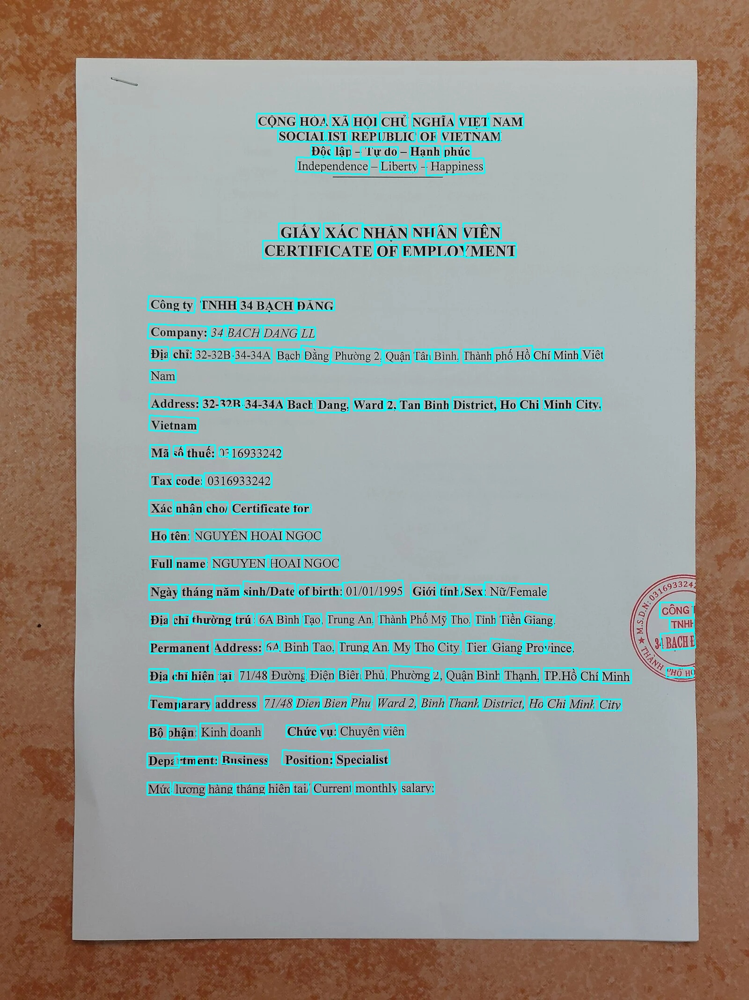

# 🇻🇳 Vietnamese OCR — Fine-tuned PaddleOCR for Vietnamese Text Recognition

A complete pipeline for **Optical Character Recognition (OCR)** on Vietnamese documents, built on top of [PaddleOCR](https://github.com/PaddlePaddle/PaddleOCR). This project fine-tunes both detection and recognition models specifically for Vietnamese text — including diacritics, medical prescriptions, invoices, and other real-world document types.

---

## ✨ Features

- **Custom-trained detection model** — DB (Differentiable Binarization) algorithm with MobileNetV3 backbone, fine-tuned on Vietnamese document layouts
- **Custom-trained recognition model** — SVTR algorithm with MobileNetV1Enhance backbone, fine-tuned with a 30,000+ entry Vietnamese character dictionary
- **Optimized inference script** — Batch processing, MKL-DNN acceleration, and multi-threaded CPU support for fast results
- **Structured output extraction** — Parses OCR results into structured JSON (e.g., patient name, medicines, dosage from medical prescriptions)
- **Kaggle-based training** — Jupyter notebooks for both training and inference, designed to run on Kaggle GPU instances

---

## 📁 Project Structure

```
Vietnamese OCR/
├── configs/
│   ├── detection_config.yml        # DB detection model training config
│   └── recognition_config.yml      # SVTR recognition model training config
├── inference/
│   ├── det/                        # Exported detection inference model
│   ├── rec/                        # Exported recognition inference model
│   └── rec_test/                   # (empty) test slot for alternate rec models
├── inference_results/
│   ├── det_res_test.jpg            # Sample detection visualization
│   └── det_results.txt             # Raw detection bounding boxes
├── log_output/
│   └── benchmark_detection.log     # Detection training benchmark log
├── models/
│   ├── best_accuracy.*             # Best recognition model checkpoint
│   ├── best_model/                 # Best model (pdparams + pdopt)
│   └── latest.*                    # Latest recognition model checkpoint
├── pretrained_models/
│   ├── detection/                  # MobileNetV3 pretrained backbone
│   └── recognition/               # PP-OCRv3 English pretrained model
├── public/                         # Sample input images (invoices, prescriptions)
├── ocr-trainning-notebook.ipynb    # Full training pipeline (Kaggle)
├── ocr-inference-notebook.ipynb    # Inference & evaluation (local/Kaggle)
├── run_ocr_optimized.py            # CLI optimized inference runner
├── ocr_results.json                # Sample OCR output (bounding boxes + text)
├── structured_invoice.json         # Structured extraction from a prescription
├── vn_dictionary.txt               # Vietnamese character dictionary (~30K entries)
└── vietnam-light.ttf               # Vietnamese font for visualization
```

---

## 🏗️ Model Architecture

### Detection Model
| Component | Detail |
|-----------|--------|
| Algorithm | DB (Differentiable Binarization) |
| Backbone  | MobileNetV3 Large (scale=0.5) |
| Neck      | DBFPN (256 channels) |
| Loss      | DBLoss (DiceLoss + BalanceLoss) |
| Pretrained | MobileNetV3_large_x0_5 |

### Recognition Model
| Component | Detail |
|-----------|--------|
| Algorithm | SVTR |
| Backbone  | MobileNetV1Enhance (scale=0.5) |
| Head      | MultiHead (CTC + SAR) |
| Loss      | MultiLoss (CTCLoss + SARLoss) |
| Dictionary | ~30,000 Vietnamese character entries |
| Pretrained | PP-OCRv3 English (en_PP-OCRv3_rec_train) |

---

## 🔧 Training

Training is performed on **Kaggle** using GPU instances via the provided Jupyter notebooks.

### Prerequisites

- Python 3.10+
- PaddlePaddle GPU 3.2+ (for training) or CPU 3.3+ (for inference)
- PaddleOCR (cloned from GitHub)

### Training Steps

1. **Open `ocr-trainning-notebook.ipynb` on Kaggle**

2. **Install dependencies:**
   ```bash
   pip install paddlepaddle-gpu==3.2.2 -i https://www.paddlepaddle.org.cn/packages/stable/cu129/
   git clone https://github.com/PaddlePaddle/PaddleOCR.git
   ```

3. **Train detection model** (100 epochs, batch size 8):
   ```bash
   python PaddleOCR/tools/train.py -c configs/detection_config.yml
   ```

4. **Train recognition model** (100 epochs, batch size 64):
   ```bash
   python PaddleOCR/tools/train.py -c configs/recognition_config.yml
   ```

5. **Export models for inference:**
   ```bash
   # Detection
   python PaddleOCR/tools/export_model.py \
     -c configs/detection_config.yml \
     -o Global.pretrained_model=output/vn_detection/best_accuracy \
        Global.save_inference_dir=inference/det

   # Recognition
   python PaddleOCR/tools/export_model.py \
     -c configs/recognition_config.yml \
     -o Global.pretrained_model=output/vn_recognition_2/best_accuracy \
        Global.save_inference_dir=inference/rec
   ```

### Training Configuration Highlights

- **Cosine LR schedule** with warmup (2 epochs for det, 5 for rec)
- **Data augmentation**: Fliplr, Affine rotation (±10°), Random resize, RecConAug
- **Adam optimizer** with L2 regularization
- **Checkpoints** saved every 10 epochs (detection)

---

## 🚀 Inference

### Quick Start (Optimized CLI)

```bash
python run_ocr_optimized.py
```

This runs OCR on `public/11.jpeg` by default with optimized settings:
- **rec_batch_num**: 32 (vs default 6 — 5× faster batching)
- **cpu_threads**: 16
- **MKL-DNN**: enabled for Intel CPU acceleration

### Programmatic Usage

```python
from run_ocr_optimized import run_ocr_simple, run_ocr_optimized

# Simple usage with sensible defaults
results = run_ocr_simple("path/to/image.jpg")

# Advanced with full control
results = run_ocr_optimized(
    image_path="path/to/image.jpg",
    use_gpu=True,           # Enable GPU if available
    rec_batch_num=64,       # Larger batch for GPU
    cpu_threads=16,
    enable_mkldnn=False     # Disable MKL-DNN when using GPU
)

# Each result contains:
for r in results:
    print(r['label'])          # Recognized text
    print(r['bounding_box'])   # top_left, top_right, bottom_right, bottom_left
```

### 📊 Inference Result

#### Visual Detection Sample
Below is a sample detection result (`det_res_test.jpg`) showing the model's ability to locate Vietnamese text in a document:



#### JSON OCR Output
The model generates text with high accuracy for Vietnamese diacritics. Here is a snippet from `ocr_results.json`:

```json
{
  "root": [
    {
      "transcription": "CỘNGHOÀXÃ",
      "points": [[543, 240], [755, 240], [755, 278], [543, 278]]
    },
    {
      "transcription": "HỘI",
      "points": [[743, 247], [814, 247], [814, 271], [743, 271]]
    },
    ...
  ]
}
```

### Output Format

Results are saved to `ocr_results.json`:

```json
{
  "root": [
    {
      "transcription": "BỆNH VIỆN ĐA KHOA GIA ĐỊNH",
      "points": [[457, 21], [809, 21], [809, 51], [457, 51]]
    }
  ]
}
```

Structured extraction example (`structured_invoice.json`):

```json
{
  "patient_name": "Thị",
  "clinic_hospital": "Phòng khám 1: Nội thần kinh",
  "date": "03/10/2025",
  "diagnosis": "Đau vùng cổ gáy...",
  "medicines": [
    {
      "name": "Oricoxib (Arcoxia)",
      "dosage": "90mg",
      "quantity": "07",
      "frequency": "1 viên/ngày",
      "instructions": "uống sau ăn"
    }
  ]
}
```

---

## 📦 Dependencies

| Package | Version | Purpose |
|---------|---------|---------|
| PaddlePaddle (GPU) | ≥3.2.2 | Deep learning framework (training) |
| PaddlePaddle (CPU) | ≥3.3.0 | Deep learning framework (inference) |
| PaddleOCR | ≥3.3.3 | OCR toolkit & model tools |
| OpenCV | ≥4.9 | Image processing |
| NumPy | ≥1.21 | Numerical operations |
| Pillow | ≥10.1 | Image handling |
| imutils | latest | Image utility functions |
| pyclipper | latest | Polygon clipping for detection |
| lmdb | latest | Dataset storage |
| rapidfuzz | latest | String matching |
| scikit-image | latest | Image analysis |
| matplotlib | latest | Visualization |

### Install for local inference (CPU)

```bash
pip install paddlepaddle==3.3.0 -i https://www.paddlepaddle.org.cn/packages/stable/cpu/
pip install paddleocr imutils pyclipper lmdb rapidfuzz opencv-python
git clone https://github.com/PaddlePaddle/PaddleOCR.git
```

---

## 📊 Use Cases

- 🏥 **Medical prescriptions** — Extract patient info, diagnosis, medicine names, dosages
- 🧾 **Invoices & receipts** — Parse Vietnamese business documents
- 🏛️ **Government documents** — Read official Vietnamese forms
- 📋 **General Vietnamese text** — Any printed Vietnamese document with diacritics

---

## 📝 Notes

- The **PaddleOCR** repository is git-cloned at runtime and excluded via `.gitignore`
- Sample test images in `public/` are also excluded from version control
- The Vietnamese dictionary (`vn_dictionary.txt`) contains ~30,545 character entries covering Vietnamese diacritics, numbers, special characters, and common word forms
- Training was originally performed on **Kaggle** with GPU (CUDA 12.9)
- For best accuracy, use the `best_accuracy.*` checkpoints rather than `latest.*`

---

## 📄 License

This project uses [PaddleOCR](https://github.com/PaddlePaddle/PaddleOCR) which is licensed under the [Apache License 2.0](https://github.com/PaddlePaddle/PaddleOCR/blob/main/LICENSE).
